# HARMONI – Event Management System

A full-stack **MERN Event Management System** developed to simplify event planning and quotation management. The application allows customers to request quotations for events while administrators manage venues, decorations, catering packages, menus, and customer requests through a dedicated admin dashboard.

---

# ✨ Features ✨ #

## 👤 Customer Module

* Secure Registration & Login
* Browse Event Services
* Submit Event Quotation Requests
* City-wise Venue Selection
* Venue Gallery Selection
* Decoration Selection
* Catering Package Selection
* Custom Menu Selection
* View Submitted Requests
* Accept or Reject Quotations

---

## 👨‍💼 Admin Module

* Secure Admin Login
* Dashboard
* Manage Customer Requests
* Send Quotations
* Manage Venues

  * Add
  * Edit
  * Delete
  * Venue Gallery
* Manage Decorations

  * Add
  * Edit
  * Delete
  * Decoration Gallery
* Manage Catering Packages

  * Add
  * Edit
  * Delete
* Manage Catering Menu

  * Starters
  * Main Course
  * Desserts
  * Beverages

---

# 🛠 Tech Stack 🛠 #

### Frontend

* React.js
* Vite
* Tailwind CSS
* React Router DOM
* Axios

### Backend

* Node.js
* Express.js
* MongoDB
* Mongoose
* JWT Authentication
* bcrypt.js

---

# 📁 Project Structure


EVENT/
│
├── frontend/
├── backend/
├── screenshots/
├── README.md
└── .gitignore

---

# 🚀 Installation 🚀 #

## Clone Repository

```bash
git clone <repository-url>
cd EVENT
```

## Backend

```bash
cd backend
npm install
npm run dev
```

## Frontend

```bash
cd frontend
npm install
npm run dev
```

---

# 🔑 Environment Variables

Create a `.env` file inside the `backend` folder.

Example:

```env
PORT=5000
MONGO_URI=your_mongodb_connection_string
JWT_SECRET=your_secret_key
```

---

# 📸 Screenshots

> Create a folder named **screenshots** in the project root and place your images there.

### Login

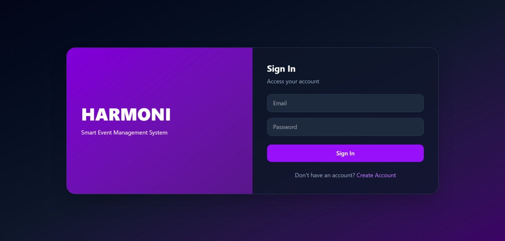


### Home

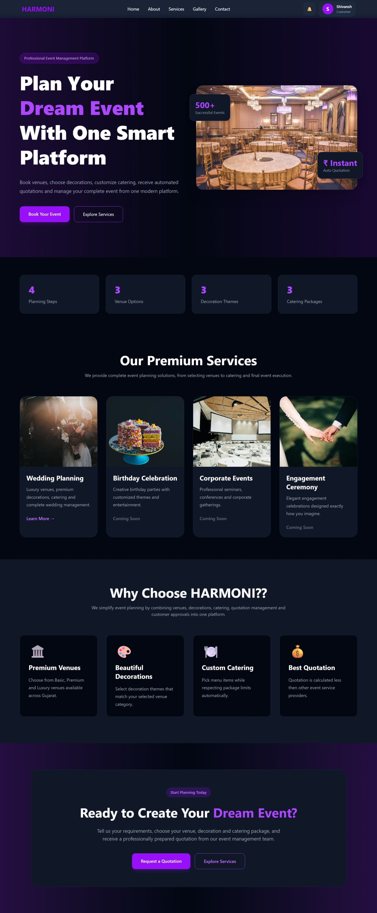

### Services

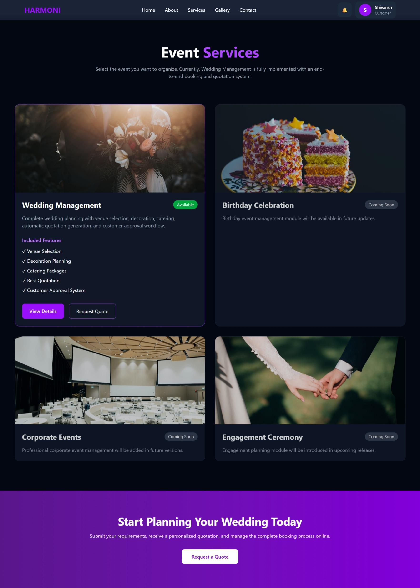

### Request Quote

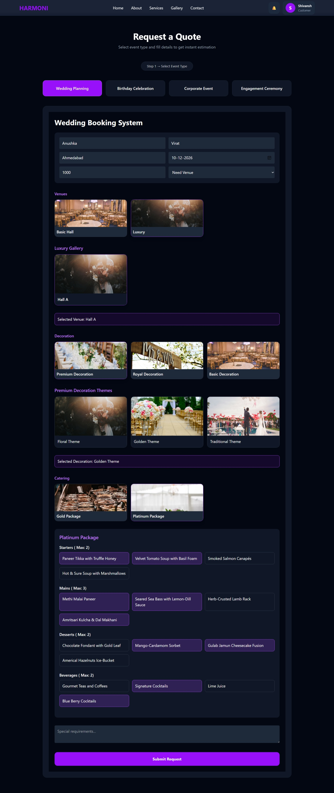

### My Requests

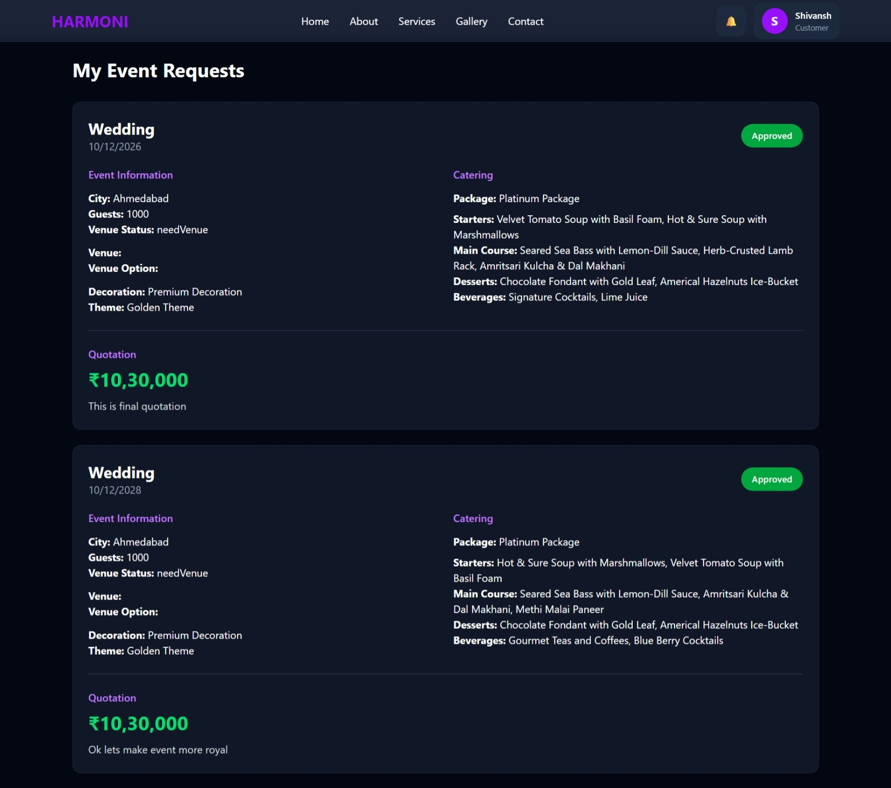

### Admin Dashboard

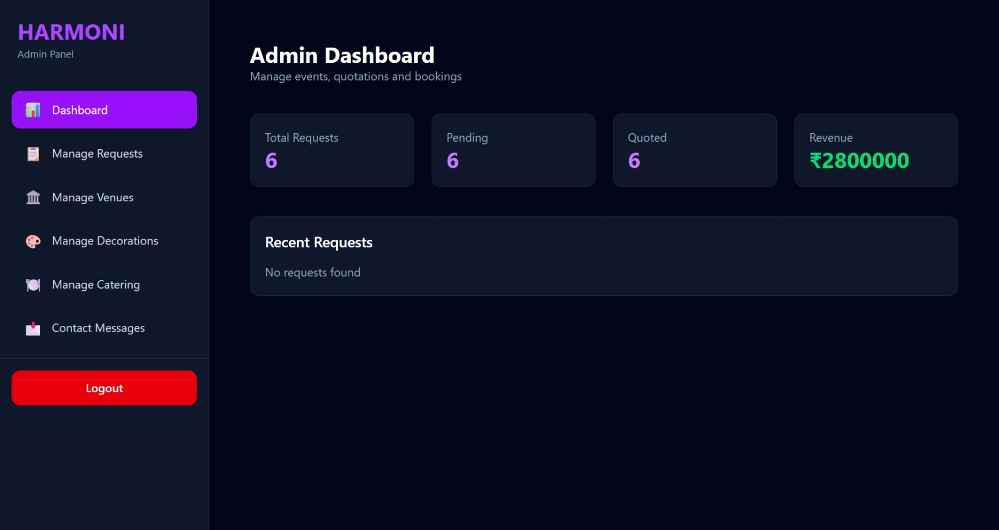

### Manage Requests

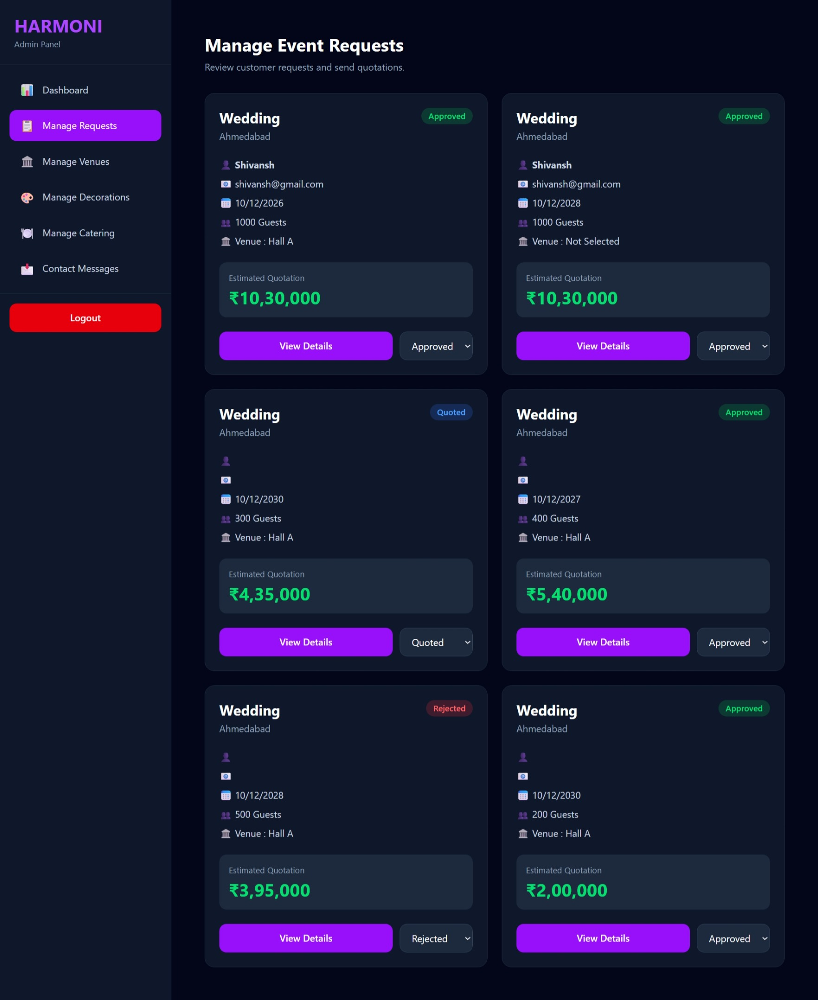

### Manage Venues

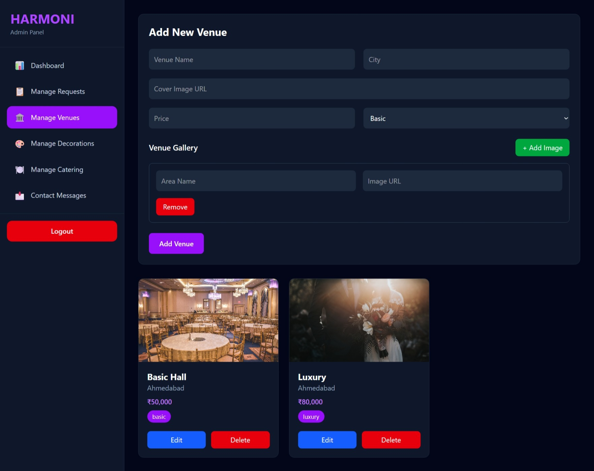

### Manage Decorations

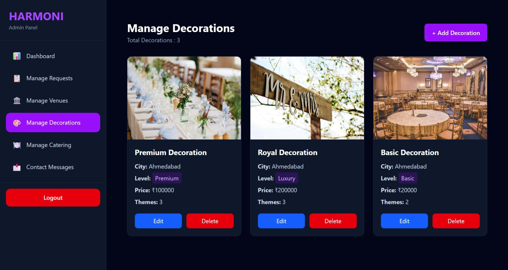

### Manage Catering

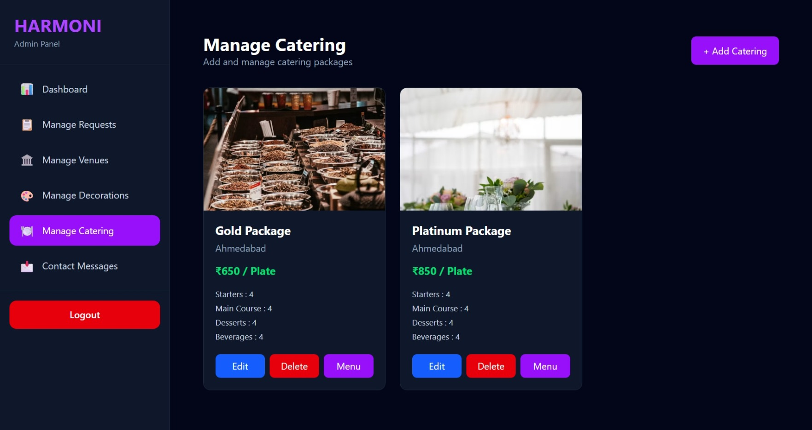

### Manage Menu

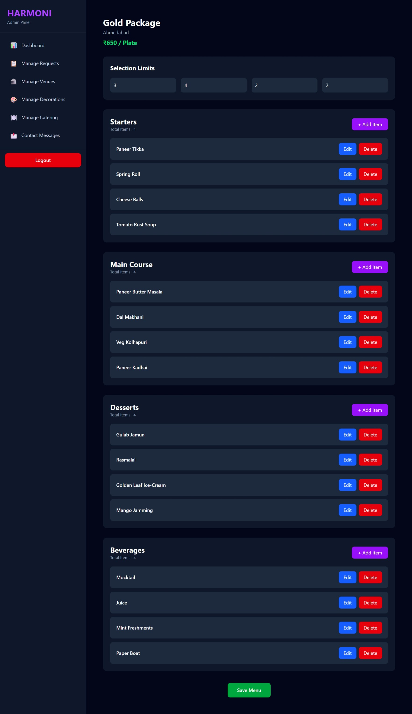
---

# 🌟 Future Enhancements

* Image Upload
* Email Notifications
* Real-time Notifications Using Socket.IO
* Online Payment Integration
* Event Calendar
* Analytics Dashboard
* Multi-admin Support

---

# 👨‍💻 Author

**Dharmik**

Developed as a MERN Stack portfolio project demonstrating authentication, CRUD operations, quotation management, admin panel functionality, and role-based access control.

---

# 📄 License

This project is intended for educational and portfolio purposes.
